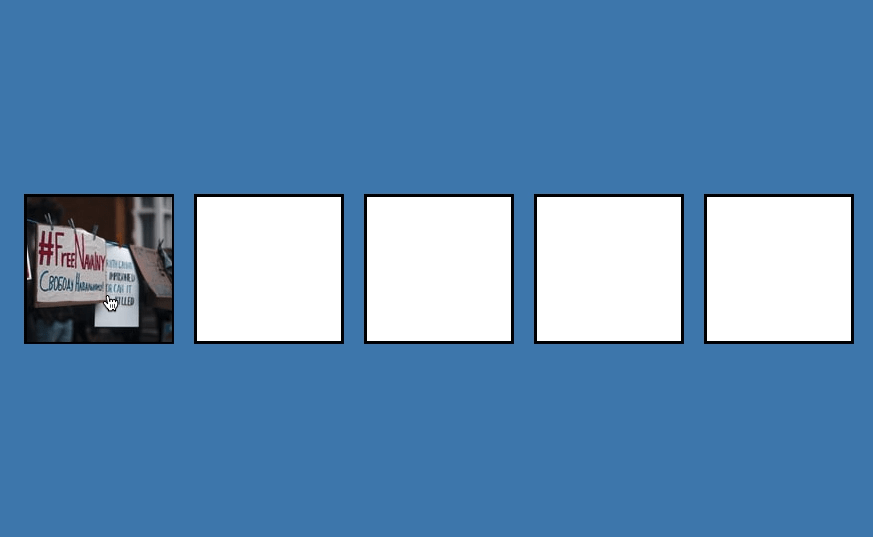
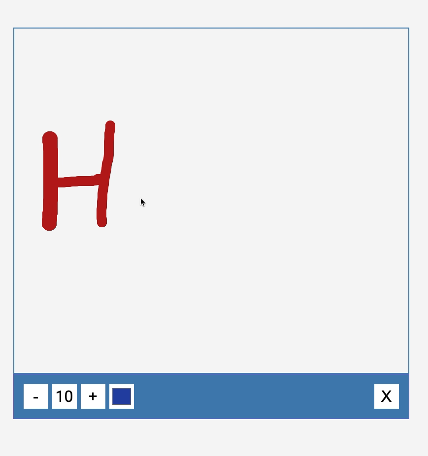

# HTML/CSS and JavaScript practice projects

 

## Button Ripple Effect

    
    <a href="day20-button-ripple-effect">code</a>

## Drag n Drop

    
    <a href="day21-drag-n-drop">code</a>

## Drawing App

    
    <a href="day22-drawing-app">code</a>

## Kinetic Loader

    
    <a href="day23-kinetic-loader">code</a>

